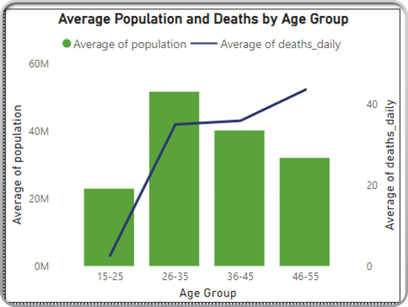

# COVID-19 Global Dashboard

## **Introduction**

### **Objective**
The goal of this project is to analyze global COVID-19 data to:
- Identify trends.
- Evaluate the factors influencing the spread.
- Assess the impact of vaccination on controlling the pandemic.

### **Key Question**
What are the key factors that contributed to the spread, severity, and mitigation of COVID-19 across different regions globally?

### **Why It Matters**
COVID-19 has profoundly impacted global health, economies, and societies. Understanding its trends, causes, and outcomes through data-driven insights is essential for:
- Informed public health policies.
- Minimizing future risks.
- Enhancing preparedness for similar crises.

---

## **Project Overview**
This project focuses on analyzing and visualizing COVID-19 data at a global level. It includes:
- Tracking key metrics such as cases, deaths, vaccinations, and testing rates.
- Forecasting future trends using predictive analytics.
- Highlighting demographic and regional disparities to provide actionable insights.

---

## **Goals and Objectives**

### **1. Global Trend Analysis**
- Monitor and analyze COVID-19 trends globally.

### **2. Vaccination and Testing Insights**
- Explore vaccination rates, testing trends, and their impact on managing the pandemic.

### **3. Interactive Visualizations**
- Provide engaging, interactive dashboards to make data accessible and comprehensible for a wide range of audiences.

### **4. Forecasting Future Trends**
- Utilize predictive analytics to forecast key metrics like case and death rates, helping anticipate future outbreaks or vaccination needs.

### **5. Regional Comparisons**
- Highlight disparities in testing, recovery, and vaccination efforts across different countries and continents.

### **6. Demographic Insights**
- Analyze age group-wise and density-wise impacts of COVID-19 to uncover critical trends and risk factors.

---

## **Hypotheses**

### **Age-Related Vulnerability Hypothesis**
Countries with a higher median age, where older populations are more prevalent, experience higher COVID-19 death rates due to increased vulnerability in older age groups.

### **Population Density and Spread Hypothesis**
Countries with higher population density have a higher number of COVID-19 cases, as densely populated areas facilitate faster airborne transmission of the virus.

### **Vaccination Effectiveness Hypothesis**
Vaccination efforts significantly reduce COVID-19 death rates by preventing severe infections and fatalities in vaccinated populations.

## Tools and Technologies Used

1. **Python**  
   - Used for data extraction, cleaning, and transformation.  
   - Key Libraries:
     - **NumPy**: For numerical computations.  
     - **Pandas**: For data manipulation and cleaning.  
     - **Seaborn**: For exploratory data analysis (EDA) and visualization.  
     - **Matplotlib**: For creating additional visualizations.  

2. **Power BI**  
   - Used for creating interactive dashboards and visualizations.  
   - Performed data modeling to establish connections within the data model for better analysis.

3. **Machine Learning**  
   - **Library Used**: **Prophet**  
   - **Reason for using this library**: The dataset was too large to process with other complex ML models. Prophet was chosen for its ability to handle large time-series data efficiently.  
   - **Model Training**: The model was trained with historical data to forecast the number of cases and deaths for the next 365 days, starting from the last available data point.

## Data Sources
The data for this project was sourced from reliable and open datasets, including:

1. **Worldwide Country-Level COVID Data**  
   - Source: [Covid19 Datahub](https://covid19datahub.io/articles/data.html)

2. **COVID-OWID Dataset**  
   - Source: [COVID-OWID on Kaggle](https://www.kaggle.com/datasets/shiv28/covidowid)

3. **COVID Vaccination vs. Mortality Dataset**  
   - Source: [Kaggle](https://www.kaggle.com/datasets/sinakaraji/covid-vaccination-vs-death)

4. **World Population by Country 2024 Dataset**  
   - Source: [Kaggle](https://www.kaggle.com/datasets/dataanalyst001/world-population-by-country-2024)

## Data Preparation Flow
   

## Data Exploration & Data Cleaning Highlights

- **Unique Country Values**:  
  The dataset initially had 236 unique values in the **Country** column. During exploration, 2 instances were identified where the values were cruise ship names instead of countries, and all their data was null.  
  - **Action Taken**: Rows with these values were dropped.

- **Data Cleaning for Country Names**:  
  4 countries were misspelled or inconsistently named across different columns.  
  - **Action Taken**: Corrected these names to ensure consistency.

- **Final Count of Countries**:  
  After cleaning, there were 230 unique country values in the dataset. This is greater than the official number of countries in the world, primarily because the dataset included records for islands (e.g., territories or regions recorded by island name instead of the country they belong to).

- **Tools Used**:  
  The **Pandas** library in Python was used for most of the data cleaning process. The CSV datasets were stored as DataFrames for further cleaning.

- **Confirmed Cases Column**:  
  The image represents how the **confirmed cases** column was filled by merging two DataFrames, significantly reducing the null values.  

  - **Action Taken**: Merged the data for **confirmed cases** by matching countries and other attributes, filling in null values.

- **Null Value Handling**:  
  Similar approaches were followed to fill null values for **recovered cases**, **tests**, and other columns.  
  - **Deaths Column**: Null values in the **deaths** column were replaced with 0, assuming no recorded deaths indicated zero fatalities.

- **Vaccines Column**:  
  - **Action Taken**: Updated the **vaccines** column in the `merged_df` for rows where the value of **people_fully_vaccinated** exceeded the current value of **vaccines**. The new value was calculated using the formula:  
    ```python
    new_vaccines = (people_vaccinated - people_fully_vaccinated) + 2 * people_fully_vaccinated
    ```

  Despite merging, some columns (e.g., **vaccines**) still had over 139k null values. The image shows how this was handled.

- **Data Cleaning & Algorithms Highlights**:

  - **Filling Missing Values**: Initially, missing values in the **vaccines** column were filled by the mean, grouping by **Country**, **year**, and **month**. The **vaccines** column was cumulative.
    - **Outcome**: This method gave unrealistic results, with vaccination numbers exceeding logical limits (e.g., 4 times the population for some countries).

  - **Final Solution**:  
    Forward filling was used to carry forward the last known value for each country, ensuring logical and realistic vaccination counts.  
    - **279,286**: Total records in the dataset.

- **Images**:  
  Below are images that represent how various columns, like **confirmed cases**, **deaths**, and **vaccines**, were handled and cleaned:
  - 
  - 
  - 
  - 

## Data Validation
  - 
  - **source**: [WHO](https://data.who.int/dashboards/covid19/cases?n=c)

## Key Visualizations

1. **Confirmed COVID-19 Cases vs. Population Density**  
   A scatter plot compares confirmed COVID-19 cases against population density (P/Km²) across different regions. While the hypothesis suggested that higher population density would result in more confirmed cases, the data does not show a strong correlation. The scattered distribution indicates that other factors, such as healthcare infrastructure and government policies, likely played a more significant role. Thus, the hypothesis was not correct.
   - 

2. **Age-Related Vulnerability to COVID-19 Deaths**  
   This graph shows that while the 26–35 age group has the largest population, the daily death rates are highest in the 46–55 age group, highlighting increased vulnerability among older populations. This aligns with the Age-Related Vulnerability Hypothesis, which suggests that countries with a higher median age experience higher COVID-19 death rates.
   - 

3. **Vaccination Rates vs. Daily Deaths**  
   This chart depicts the relationship between daily vaccination rates (green line) and daily deaths (blue line) over time. It shows that as vaccination efforts increased during 2021, the average daily deaths began to decline significantly, particularly after peak vaccination periods. This supports the hypothesis that vaccination efforts effectively reduced COVID-19 death rates.
   - 
## Key Findings

- **Fluctuations in Deaths and Cases**:  
  Average deaths and cases display significant fluctuations, reflecting waves of outbreaks.

- **Impact of Vaccination**:  
  Vaccination efforts correlate with decreased case and death rates over time.

- **Public Health Priorities**:  
  Public health interventions and medical resources should prioritize older populations, especially those aged 46 and above, to mitigate fatality risks.

- **Post-2023 Trends**:  
  A significant reduction in deaths and cases beyond 2023, indicating potential control measures.

- **Regional Differences**:  
  Europe records the highest number of deaths, followed by Asia and South America.

- **Vaccination and Mortality**:  
  Countries with higher vaccination percentages show lower mortality and higher recovery percentages.

## Challenges

One of the biggest challenges for this project was **data quality**, as the dataset contained approximately 100k null values across multiple columns. Identifying patterns and filling these gaps was a complex and time-consuming process, requiring careful validation to ensure accuracy.

## Recommendations and Conclusions

- **Targeted Public Health Interventions**:  
  Government bodies and policymakers should prioritize the most affected age groups to design targeted public health interventions and optimize resource allocation.

- **Monitoring Vaccination Progress**:  
  Vaccination progress should be monitored by country to identify and address gaps in global immunization efforts.

- **Optimize Healthcare Deployment**:  
  Integrate insights on geographical spread to optimize testing and healthcare infrastructure deployment.

- **Leverage Time-Series Trends**:  
  Leverage time-series trends to predict and prepare for potential future infection spikes.

## Hypothesis Outcome

- **Age-Related Vulnerability Hypothesis**:  
  Confirmed to be true, as countries with a higher median age experienced significantly higher death rates due to increased vulnerability in older populations.

- **Population Density and Spread Hypothesis**:  
  Found to be false, as no direct correlation was observed between population density and the spread of COVID-19 infections.

- **Vaccination Effectiveness Hypothesis**:  
  Validated as true, with vaccination campaigns proving effective in reducing death rates by preventing severe infections and fatalities.


